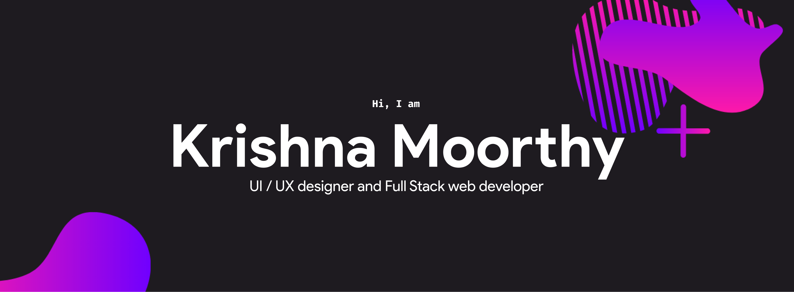

<!-- BETA [coming soon]
 

	  

 -->

	<a href="mailto:akrishnamoorthy007@gmail.com" target="_blank" align="center">Send Email</a> |
	<a href="https://devkrish.tech" target="_blank" align="center">Portfolio</a> |
	<a href="https://polywork.com/krish_the_dev" target="_blank" align="center">Polywork</a>

<h3 align="center">Connect with me</h3>

<!-- Streak -->

<!-- Activity graph -->

 

<!-- Trophies -->

  

  
<h3 style="display: inline;">Who am I?<h3>

	

		Hi, my name is Krishna Moorthy, I’m from Chennai, born and brought up. I'm a senior year CS student at the University College of Engineering, Trichy. I specialize in the field of web development and designing. I love to design and code 👨🏼‍💻. I concentrate on writing clean, understandable and testable code. I love to work in a team.   
		Other than coding, I'm passionate about Astronomy 🌌 and bicycling 🚴‍♂️. I like to cook 🍳 in my leisure time. I spend most of my time building something I like, When I don’t, I watch movies 🎥, especially Hollywood and series like The <a href="https://www.netflix.com/in/title/70143830?source=35">Big Bang Theory</a> and <a href="https://www.hotstar.com/in/tv/silicon-valley/8210?utm_source=gwa">Silicon Valley</a>. I like listening to Pop and Rock music 🎶. My favorite singer is <a href="https://open.spotify.com/artist/3WGpXCj9YhhfX11TToZcXP">Troye Sivan</a>. I love cats 😼, although I don’t have one.    
		I’m more of a casual person, I think everybody as a fellow human, regardless of their status. I strongly support equality; equality among genders, race, sexuality, religion, cast etc. People should be valued equally regardless of their birth.    
		Other than all these, I love talking to people!
	

	
<h3 style="display: inline;">What do I know?</h3>

	<h4 align="center">Languages and Libraries</h4>
	

	<table align="center">
		<tr align="center">
			<td align="center" width="96">
				
				 HTML
			</td>
			<td align="center" width="96">
				
				 CSS
			</td>
			<td align="center" width="96">
				
				 Sass
			</td>
			<td align="center" width="96">
				
			 Styled
			</td>
			<td align="center" width="96">
				
				 JS
			</td>
			<td align="center" width="96">
				
				 TS
			</td>
			<td align="center" width="96">
				
				 Java
			</td>
			<td align="center" width="96">
				
				 Python
			</td>
			<td align="center" width="96">
				
				 NodeJS
			</td>
			<td align="center" width="96">
				
				 React
			</td>
			<td align="center" width="96">
				
				 NextJS
			</td>
			<td align="center" width="96">
				
				 GraphQL
			</td>
		</tr>
	</table>
	

	<h4 align="center">Tools and other stuff</h4>
	

	<table>
		<tr>
			<td align="center" width="96">
				
				 MongoDB
			</td>
			<td align="center" width="96">
				
				 AirTable
			</td>
			<td align="center" width="96">
				
				 Sequelize
			</td>
			<td align="center" width="96">
				
				 Auth0
			</td>
			<td align="center" width="96">
				
				 Figma
			</td>
			<td align="center" width="96">
				
				 Heroku
			</td>
			<td align="center" width="96">
				
				 Netlify
			</td>
			<td align="center" width="96">
				
				 Vercel
			</td>
			<td align="center" width="96">
				
				 Prettier
			</td>
			<td align="center" width="96">
				
				 ESlint
			</td>
		</tr>
	</table>
	

	

  
<h3 style="display: inline;">What do I do?<h3>

	<table align="center">
		<tr>
		<td align="center">
		 
		</td>
		<td align="center">
		 
		</td>
	</table>
	  
 The above stats do not show my skill levels or proficiency. It just shows what languages I use the most. The stats are not accurate and some aren't even listed. P.S: Please don't ask me if I'm a C developer or HTML Programmer.

